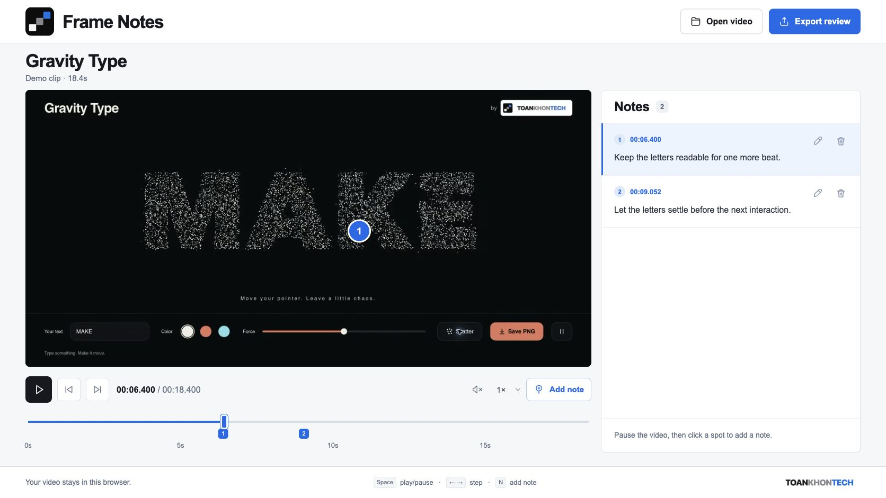
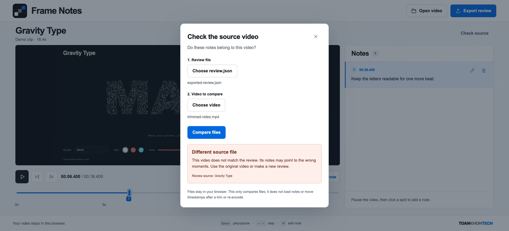

# Frame Notes

Pause a video, pin a note, export the frame.

[Try the demo](https://toankhontech.github.io/frame-notes/) · Built by [ToanKhonTech](https://toankhontech.com)



Frame Notes is a small browser tool for giving precise visual feedback on a recorded UI or animation. The ZIP gives a person or coding agent the note, its time and position, and the annotated image together.

## Use it

1. Try the bundled Gravity Type clip, or open a local video.
2. Pause and click a spot on the video. Write a note and save it.
3. Click a note or its timeline marker to jump back to that moment.
4. Export the review. Unzip it to read `review.md`, parse `review.json`, or inspect `frames/*.png`.

Space plays/pauses, left/right arrows move by 0.1 seconds, and N adds a note at the center. Escape cancels an edit. Ctrl/Cmd+Enter saves it. Shortcuts do not run while typing in a field. You can edit notes, delete them, and undo the latest deletion.

## Check a review’s source video

New exports include a SHA-256 fingerprint of the complete video file in `review.json` and `review.md`. To compare a handoff with a video, click **Check source**, choose the exported `review.json` and the candidate video, then **Compare files**. The check does not change your open video or notes.

- **Same source file:** the bytes match, including when the file has been renamed.
- **Different source file:** a trim, re-encode, metadata edit, or other byte change produces a mismatch. Use the original source or make a new review.
- **Source not verified:** a version 1 review without a fingerprint cannot identify the original file. Matching filenames and durations are insufficient.

Local-file hashing runs in a Web Worker, reads 4 MiB at a time, and can be cancelled. The bundled demo’s fingerprint is computed from its exact asset during the build, so exporting it does not download the whole clip again. Changing either file or closing the dialog cancels the previous check and clears its result. JSON reviews are limited to 2 MiB; video hashing has no fixed size cap. Browser resources and codec support still limit video editing.

This checks exact file identity, not visual similarity, and does not remap timestamps after an edit. A fingerprint is not a signature: it does not authenticate the review’s author or prove the metadata has not been modified.



## What stays local

Selected videos are read with browser object URLs. There is no upload endpoint, analytics, account, AI call, or backend. The app downloads its static files and demo clip from the hosting service. Notes and captured frames live in memory for the current tab; export before closing. ZIP files do not include the source video.

## Limits

- Times use browser media seconds, not frame-accurate timecode. A displayed millisecond value does not imply millisecond capture accuracy. Stepping is 0.1 seconds, not one frame.
- Video support depends on the browser and codec. MP4/H.264 and WebM are good starting points. Large clips and many high-resolution snapshots can use substantial memory.
- This is manual review. It does not find visual errors or evaluate model quality automatically.
- The bundled note is illustrative. It is not a measured defect or benchmark result.
- There is no saved project or note restoration yet; loading JSON in Check source only checks file identity. A successful export starts a browser download; check your download folder before closing the tab.

## Run locally

Node.js 20.19+ or 22.12+.

```sh
npm ci
npm run dev
```

```sh
npm test
npm run build
npm run preview
```

React + Vite, native HTML video and Canvas, JSZip, and [@noble/hashes](https://github.com/paulmillr/noble-hashes) for incremental SHA-256. Export metadata uses schema version 2, seconds from the source start, and normalized x/y coordinates from the top-left. Snapshot pixels are captured when a note is created, so editing its text keeps the original frame.

## Validation

Checked in desktop Chrome at 1672px and 1440px, and responsive emulation at 390px and 360px. The local-file flow, playback, 0.1s seek, keyboard note creation, edit/delete/undo, and ZIP download were exercised through the browser UI. Exported JSON and PNGs were inspected against the source clip. Unit tests cover time rounding, export field boundaries, Markdown escaping, and clamping. Mobile emulation is not a physical-device test.

Source-check update: nine unit tests pass. Real Chrome file selection verified matching renamed bytes, a trimmed/re-encoded mismatch, old reviews without fingerprints, malformed JSON, and cancellation/replacement during hashing. Both demo and local-video ZIP fingerprints were compared with an independent SHA-256 calculation.

## Credits and license

Implemented with Codex; the visual concept was made with ImageGen. The demo clip is an actual recording of [Gravity Type](https://github.com/toankhontech/gravity-type), another ToanKhonTech experiment.

The original app code is MIT-licensed. ToanKhonTech brand files and the demo video remain ToanKhonTech assets and are excluded from that code license. The brand files are provided unchanged; this repository does not grant trademark rights. React/React DOM, JSZip and @noble/hashes retain their own licenses; see `public/THIRD_PARTY_LICENSES.txt`.
